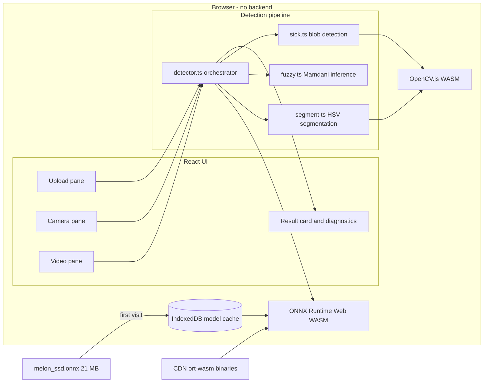
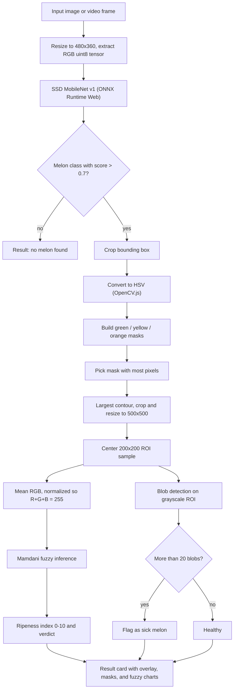
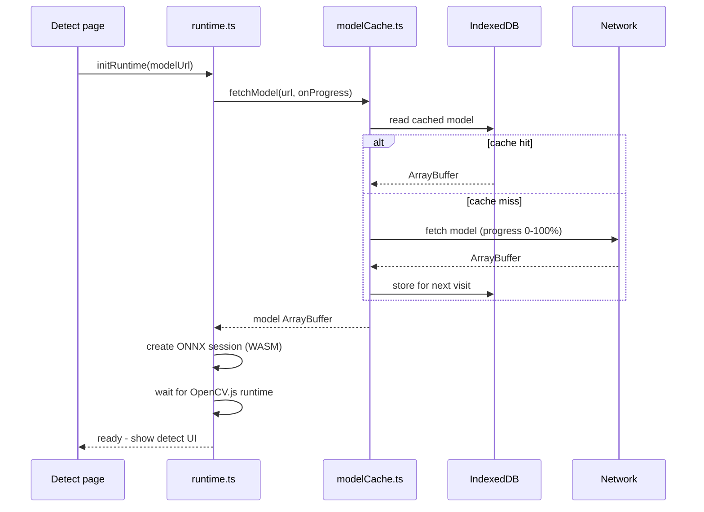

# Melon Ripeness Detector

A pure client-side web app that detects melons in a camera feed and estimates ripeness in real time. All inference runs in the browser — no backend, no server round-trips. The pipeline combines SSD MobileNet object detection, HSV color segmentation, Mamdani fuzzy logic, and blob-based sick detection.

## How it works

### System overview

Everything runs inside the browser tab. The only network traffic is the one-time model download (cached in IndexedDB afterwards) and the ONNX Runtime WASM binary from a CDN.



### Detection pipeline

Each detection request walks through four stages: locate the melon, isolate its surface color, infer ripeness with fuzzy logic, and check for disease.



### Model loading and caching

The 21 MB ONNX model is downloaded once with a progress bar, then served from IndexedDB on every later visit.



### Ripeness verdict

The fuzzy system takes the normalized mean blue, green, and red values of the melon surface, fires Mamdani rules against trapezoid membership functions, and defuzzifies with the centroid method into a 0–10 index:

| Ripeness index | Verdict |
| --- | --- |
| no rules fired | False positive (not a melon surface) |
| below 3.5 | Under Ripe |
| 3.5 – 6.5 | About to Ripe |
| 6.5 and above | Ripe |

Intuition: an unripe canary melon is greenish (high blue/green share, very low red), and as it ripens the surface shifts toward yellow-orange (red share climbs, blue share drops). Independently of ripeness, more than 20 dark blobs on the ROI marks the melon as sick.

## Quick start (development)

```bash
cd web
npm install
npm run dev
```

The ONNX model must be present at `public/model/melon_ssd.onnx` before starting. It is converted from the frozen TensorFlow graph — see `../scripts/convert_model.md` for the exact command.

## Production build

```bash
npm run build
# Static output is written to dist/
```

## Docker

```bash
docker build -t melon-ripeness-detector .
docker run -p 8080:80 melon-ripeness-detector
# Open http://localhost:8080
```

The included `nginx.conf` sets the correct WASM MIME type and COOP/COEP headers automatically.

## Model conversion (one-time)

The ONNX model is converted from `ssd_melon_model_18853/frozen_inference_graph.pb`. The exact conversion command and environment requirements are documented in `../scripts/convert_model.md`.

## Architecture

- **Object detection**: SSD MobileNet v1 via ONNX Runtime Web (WASM backend)
- **Color segmentation**: HSV masking via OpenCV.js
- **Ripeness inference**: Mamdani fuzzy logic (pure TypeScript, no external library)
- **Sick detection**: blob counting via OpenCV.js

## Why COOP/COEP headers

`Cross-Origin-Opener-Policy: same-origin` and `Cross-Origin-Embedder-Policy: require-corp` are required to enable `SharedArrayBuffer`, which ONNX Runtime Web uses for multi-threaded WASM execution.
